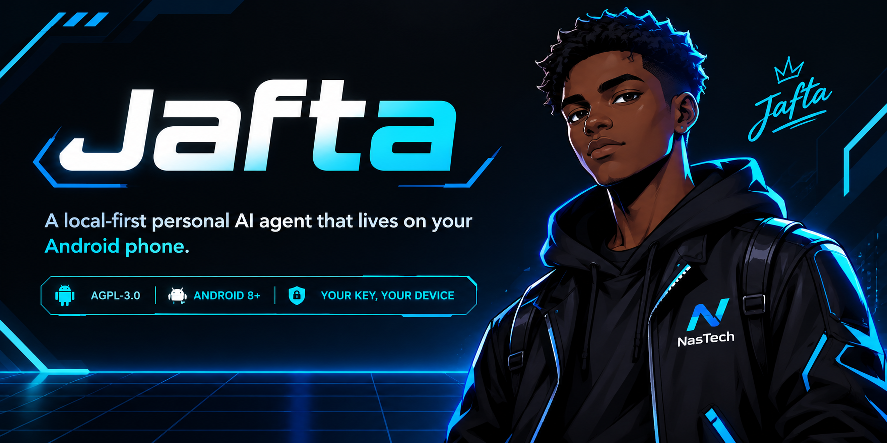

<div align="center">



### A local-first personal AI agent that lives on your Android phone

It remembers you permanently, acts on a schedule without being asked, writes its own
mini-apps on request, and can *be* your phone's home screen. Your memory, files and
conversations stay on the device. Bring your own API key — or run a model on your own
hardware and keep the whole loop offline.

[](../../releases/latest)

[](LICENSE)
[](#quick-start)
[](https://jafta.nastechresearch.com/docs/internals/architecture/)
[](https://jafta.nastechresearch.com/docs/reference/providers/)
[](#privacy-and-security)

[**Documentation**](https://jafta.nastechresearch.com/docs/) · [Quick start](#quick-start) · [Features](#what-it-can-do) · [Privacy & security](#privacy-and-security) · [Limitations](#known-limitations) · [FAQ](#faq)

</div>

<!-- Captured on the Android emulator at 1080x1920 (a 16:9 phone) with
     `scripts/capture_screenshots.sh`. Unretouched framebuffer grabs; only the status bar is
     in Android's demo mode (fixed clock, full battery, no notification icons).

     Width 200 is not arbitrary: GitHub's README column is 838px and does not grow with the
     window (`container-lg` caps it). Four images at 200px plus the inter-tag whitespace come
     to ~814px, so the row holds on desktop and stacks on mobile instead of wrapping into a
     ragged 3+1. At 215px it no longer fits. -->

<p align="center">
  
  
  
  
</p>

---

## An AI agent that runs on your phone, not in someone's cloud

Jafta is an Android app with an embedded Python runtime. It registers as a HOME activity, so
if you want, pressing Home lands you in a conversation instead of a grid of icons. A
foreground service keeps the agent alive with the screen off — which is what makes scheduled
work and proactive messages possible at all.

If you have ever self-hosted an AI agent on a server, this is that: except the host is a
phone you already own, it has a screen, and its battery is the UPS.

**It is a 1.0, built by one person, not a polished consumer product.** Sideloaded, no store and no silent auto-updates (Jafta tells you when a release exists and installs it only when you confirm), and the
[known limitations](#known-limitations) are listed in full rather than discovered later.

## Is it actually free software?

The question worth answering first, because "AI agent" plus "API key" usually means a
proprietary service with an open-source shell.

- **The app is AGPL-3.0**, all of it, and it builds from this repository with no extra steps.
- **There is no service of mine anywhere.** No account, no sign-up, no telemetry, no
  analytics, no crash reporter, no server of mine in the loop. Not a policy — there is
  nowhere for me to look from.
- **The model provider is your choice, and it is optional.** Point Jafta at Ollama or
  LM Studio on your own hardware and the loop is fully offline: no traffic leaves your
  network. See [local models](https://jafta.nastechresearch.com/docs/reference/local-models/).

If you use a hosted provider, then yes — your prompts go to that provider under your own key,
and Jafta depends on a non-free network service for as long as you choose one. That is your
decision per install, not a property of the app.

## What it can do

**🧠 Permanent on-device memory.** Every couple of hours a background pass replays the recent
conversation and distils it into structured Markdown on disk: who you are, the agent's own
behavioural notes, an index of durable context, and any procedure it saw you repeat, written
down as a reusable skill. Noise is pruned, signal accumulates. It's plain Markdown on the
device, so switching provider doesn't cost you your memory.
→ [Memory](https://jafta.nastechresearch.com/docs/using/memory/)

**📚 It builds you a wiki.** Feed it articles, notes, PDFs or web pages and ask it to compile
them: you get cross-linked Markdown pages — concepts and entities, joined by `[[wikilinks]]` —
browsable from the notebook they belong to, with a graph view of how they connect (that's the fourth screenshot
above). Driven entirely from chat through a built-in `llm-wiki` skill: create one, ingest a
source, compile, ask it questions, run a lint pass for dead links and orphan pages. It does
**not** update itself — every step is a request you make, or a job you schedule. Multiple wikis
live side by side as plain files in the workspace, so they're editable and backed up like
everything else. → [Wiki](https://jafta.nastechresearch.com/docs/using/wiki/)

**⚡ It acts on its own.** Reminders, one-shot actions and recurring jobs ("every Monday,
summarise my week"). When one fires, **it messages you first**, screen off. It reads and
writes files, executes Python, and searches the web through a real hidden Chrome WebView
rather than a plain fetch, so JavaScript-rendered pages work.
→ [Scheduling](https://jafta.nastechresearch.com/docs/using/scheduling/) ·
[Tools](https://jafta.nastechresearch.com/docs/reference/tools/)

**🛠️ It writes its own Android mini-apps.** Describe one in chat — "something to track my
plants" — and the agent builds it: UI, typed actions, persistent storage, installed into its
own app grid. Each action becomes a callable tool, so the same app is usable by you, by the
agent in conversation, and by anything that triggers a turn, **including cron**. That last one
is what makes "alert me if the basil needs water" work end to end.
→ [Mini-apps](https://jafta.nastechresearch.com/docs/using/mini-apps/)

**📱 It can be your Android launcher.** It declares `HOME` + `DEFAULT` + `LAUNCHER` and handles
the Home gesture, listing and launching your installed apps from a panel inside the UI. Seven
visual themes and a draggable mascot you can switch off. Judged purely as a launcher it would
be a bad one — no widgets, folders or icon packs. The launcher part is the *how*, not the
*what*. → [Launcher setup](https://jafta.nastechresearch.com/docs/start/launcher-setup/)

**💬 Optional [Telegram bridge](https://jafta.nastechresearch.com/docs/using/telegram/)** for
reaching the agent from anywhere — outbound-only, your own bot token, so nothing on your
network becomes reachable from the internet. Messages through it pass through Telegram's
servers; your memory and files never do. Off by default.

## Quick start

Download the APK from [**Releases**](../../releases/latest) — Android 8.0 or newer, ~72 MB,
most of which is the embedded CPython runtime. Verify it against the hash published on the
release page:

```bash
shasum -a 256 jafta-1.0.0.apk
```

Android will ask you to allow installing from outside the Play Store. The APK is signed with
my own key (RSA 4096, schemes v2 and v3) — no store vouches for it, which is the deal with
sideloading, and checking the hash is how you confirm you got the file I built. Then launch it,
follow onboarding, paste your API key. No account to create, at any point.

Or **build it yourself** — the whole thing builds from this repository, which is rather the
point of not having a store in the middle.

[Installing](https://jafta.nastechresearch.com/docs/start/install/) ·
[first run](https://jafta.nastechresearch.com/docs/start/first-run/) ·
[build from source](https://jafta.nastechresearch.com/docs/contribute/build-from-source/) ·
[is it for you?](https://jafta.nastechresearch.com/docs/start/is-jafta-for-you/)

## Privacy and security

Memory, conversations, files and generated apps live in the app's private storage. The web UI
is served on **loopback by default** (`127.0.0.1`) — no port exposed to your network, nothing
to reverse-proxy, no inbound attack surface unless you deliberately rebind it. The API is
token-gated even on loopback, because Android does not isolate loopback TCP between apps.

Jafta makes six kinds of outbound connection — your provider, Bing when it searches,
`api.telegram.org` if you enabled the bridge, any URL you or the agent explicitly fetch,
OpenRouter's attribution headers when that's your provider, and a daily check for a new
release. **None of them carries anything about you.** (Beyond these, there are only the
connections you set up yourself: SSH to hosts you register, and the HTTP actions of mini-apps you
install.) The update check is a plain `GET` of the
`latest.json` published with the release: no identifier, no version, no headers of ours, no
query string — a public file fetched and compared on the device. It is the only one that goes
to a server this project controls, and the only one you did not switch on: it runs every 24h,
and `updates.enabled: false` stops it. Jafta declares 16 permissions and asks for **no**
camera, microphone, contacts, SMS, call log, background location or storage.
→ [Every connection and permission](https://jafta.nastechresearch.com/docs/reference/android-permissions/)

Two disclosures I would rather you hear from me than discover:

- **Your prompts go to whichever provider you chose.** On-device storage is not on-device
  inference. If a location fix ends up in the agent's reasoning, it ends up in that prompt.
- **`android:allowBackup="true"` is set on purpose** — losing your memory when you change
  phone would be worse. But with Google backup on, the app's private storage, *including the
  config file that holds your API keys in plain text*, is eligible for your Google account's
  backup. Turn backup off for this app and use Jafta's own encrypted backup instead.
  → [Privacy in detail](https://jafta.nastechresearch.com/docs/internals/privacy/)

Security, short version: **`python_exec` is not a sandbox** — arbitrary Python, in-process; the
module lists are a usability guardrail, not containment. **Provider keys are plain text**,
protected by the app sandbox and readable by the agent's own file tools. **Prompt injection is
not solved** — nobody's is; asking Jafta to "read this URL and do what it says" is handing a
stranger your tools. [**SECURITY.md**](SECURITY.md) is the long version, written to be useful
rather than reassuring — read it before you point this at anything you care about.
→ [Security model](https://jafta.nastechresearch.com/docs/internals/security-model/)

## Known limitations

Collected in one place rather than scattered, so you can judge before installing.

- **Sideload only.** A signed APK on Releases, and the source. No Play Store, no F-Droid
  listing. Jafta does check daily whether a newer release exists and can install it when you
  say so, but nothing updates itself behind you: Android still shows its own install prompt.
- **Not a full launcher.** No widgets, folders, icon packs or wallpaper management.
- **Web search is Bing-only.** A real CAPTCHA page fails rather than being solved.
- **Goals and subagents are separate tools, not an orchestrator.** A registered objective
  stays in context across turns, and the agent *can* delegate to background subagents, but
  nothing guarantees a goal is automatically decomposed and driven to completion — delegation
  is a per-turn decision by the model.
- **Mini-apps can't reach authenticated servers.** Declaring `auth` in a manifest is refused
  outright until there's a credential store.
- **Small models struggle.** The agent loop leans hard on instruction-following and
  tool-calling; quality tracks the model, and below the frontier tier it varies a lot.
- **Battery is unmeasured.** It idles cheaply and asks for battery-optimisation exemption,
  but I haven't published numbers and won't invent them.
- **Android only.** Not a temporary gap — the whole design assumes a device you own that
  stays on.

## Status and roadmap

**1.0, the first stable release.** It has been my daily driver for months, and from here on a
change that breaks something you rely on gets a new major number — see the
[changelog](CHANGELOG.md). It is still one person's project with rough edges, onboarding most of
all, which is exactly where feedback is worth most.

Not promised, roughly in order: measured battery numbers · voice in and out · a credential
store so mini-apps can reach authenticated servers · the agent operating other apps on the
phone · richer system surfaces.

## Contributing

Issues and PRs welcome — see [CONTRIBUTING.md](CONTRIBUTING.md) and
[CODE_OF_CONDUCT.md](CODE_OF_CONDUCT.md). Contributions need a
[DCO](https://developercertificate.org/) sign-off (`git commit -s`).

The most useful contribution right now isn't code: install it, try to set it up without
reading anything, and tell me exactly where you got stuck.

If the idea seems worth existing, a **star** is what makes it findable by the next person who
would want it — GitHub's search ranks on them, and this project has no marketing budget.

## Architecture

A native Android app with an embedded CPython 3.11 (Chaquopy 17), `minSdk 26` /
`targetSdk 34`. The agent runs as a persistent foreground service and serves a mobile-first
SPA over loopback. Messages flow through an async bus that decouples the channel from the
core. Over 12,000 tests; CI runs `ruff`, `pytest` on 3.11 and 3.12, and `pyright` — blocking on the
subsystems that are already type-clean, advisory on the rest, which is the honest state of a
codebase being tightened rather than one pretending to be finished.

→ [Architecture](https://jafta.nastechresearch.com/docs/internals/architecture/) ·
[Concepts](https://jafta.nastechresearch.com/docs/internals/concepts/) ·
[The agent turn](https://jafta.nastechresearch.com/docs/internals/agent-turn/)

## License, trademark, and upstream

Code is [**AGPL-3.0**](LICENSE). Jafta is a fork of
[nanobot](https://github.com/HKUDS/nanobot) (MIT, by Xubin Ren) — what this fork keeps,
removes and rewrites is documented in [FORK_BOUNDARY.md](FORK_BOUNDARY.md), and upstream's
license is reproduced verbatim in [THIRD_PARTY_NOTICES.md](THIRD_PARTY_NOTICES.md) along with
every bundled library and font.

The **Jafta name, logo and mascot artwork are not** under the AGPL grant — see
[TRADEMARK.md](TRADEMARK.md). Fork the code freely; ship it under your own name.

*Developed by [flagDiZero](https://github.com/nastechresearch). Copyright © 2026 Ludovico Ragno.*

## FAQ

**Is this a launcher like Nova or Niagara?**
No — the launcher is the *how*, not the *what*. Jafta is a personal AI agent; being the home
screen is what makes it present instead of an app you remember to open.

**Does it really work offline, with local models?**
Yes — Ollama and LM Studio through the OpenAI-compatible engine. With the model on your LAN
and the Telegram bridge off, no traffic leaves your network at all. Expect quality to track
the model.

**What does it cost?**
The app is free and open source. You pay your provider directly, or nothing with a local model.
My marginal AI cost is zero, so there is no incentive to ration your usage — an architectural
fact, not a pricing promise.

**Why AGPL, if it never touches a server?**
So a hosted fork can't take the work closed. Personal use is unaffected.

## On the record

So they can be held against me: **BYOK is free, forever** — using Jafta with your own key
will never require a subscription, an account, or a payment to me. And **local-first is the
architecture, not a launch feature.** Don't trust that sentence; check the permissions and the
source. That's why they're public.

## Support the project

No subscription to sell you and BYOK stays free, so donations are the only thing funding the
work.

<!-- Height pinned on both: the Ko-fi badge is 223x30 while the Buy Me a Coffee
     one is 545x153, so at natural size they render wildly mismatched. -->
<a href="https://ko-fi.com/nastechresearch"></a>
&nbsp;
<a href="https://buymeacoffee.com/nastechresearch"></a>

---

<div align="center">

*Local-first personal AI agent for Android · on-device memory · BYOK · offline-capable · AGPL-3.0*

**[Documentation](https://jafta.nastechresearch.com/docs/) · [Quick start](#quick-start) · [Report an issue](../../issues)**

</div>
